# @manzhixing/web-storage-adapter

封装了 **Web 本地存储([`Web Storage`](https://developer.mozilla.org/zh-CN/docs/Web/API/Storage))** 的存取方法的工具  
提供了自动序列化和反序列化的功能，以便于直接存取几乎所有**JavaScript数据类型的值**，而无需手动进行序列化和反序列化的转换。  
以一种更简洁和统一的方式来处理本地存储的操作，并且不必担心数据类型的转换问题。这使得代码更易于维护和阅读，并提高了开发效率。

## 安装

```sh
#PNPM
pnpm add @manzhixing/web-storage-adapter

# NPM
npm install @manzhixing/web-storage-adapter

# YARN
yarn add @manzhixing/web-storage-adapter
```

## 属性&方法

|属性|说明|
|---|---|
|`length`|[Storage.length](https://developer.mozilla.org/zh-CN/docs/Web/API/Storage/length):返回存储在给定的 Storage 对象中的数据项的数量|

---

|方法|参数|说明|
|---|---|---|
|`set`\|`setItem`|`keyName`:string, `keyValue`:any|[Storage.setItem(keyName, keyValue)](https://developer.mozilla.org/zh-CN/docs/Web/API/Storage/setItem):传递了一个键名和值时，将会把键名添加到给定的 Storage 对象中，如果键名已存在，则更新其对应的值|
|`get`\|`getItem`|`keyName`: string|[Storage.getItem(keyName)](https://developer.mozilla.org/zh-CN/docs/Web/API/Storage/getItem):传递一个键名时，将返回该键的值；而如果在给定的 Storage 对象中不存在该键，则返回 null|
|`remove`\|`removeItem`|`keyName`: string|[Storage.removeItem()](https://developer.mozilla.org/zh-CN/docs/Web/API/Storage/removeItem):传递一个键名时，将从给定的 Storage 对象中删除该键（如果它存在）|
|`clear`|-|[Storage.clear()](https://developer.mozilla.org/zh-CN/docs/Web/API/Storage/clear):清除给定 Storage 对象中存储的所有键|
|`key`|`index`: number|[Storage.key(index)](https://developer.mozilla.org/zh-CN/docs/Web/API/Storage/key):传递一个数字 n 时，返回给定存储对象中第 n 个键的名称|
|`addTypeOption`|`type`: string, `options`: TypeOperation|[addTypeOption(type, options)](https://chengbotao.github.io/utilsxy/web-storage-adapter/classes/webstorageadapter.html#自定义序列化和反序列化ßßß):添加一个序列化和反序列化的类型选项，以便于对特定类型的值进行序列化和反序列化|

在使用`localStore`和`sessionStore`时，你可以像使用普通的`localStorage`和`sessionStorage`一样设置和获取值。  
当你使用`localStore.set`或`sessionStore.set`方法存储一个值时，它们会自动将该值进行序列化，并将序列化后的字符串作为值存储到对应的存储空间中。  
而当你使用`localStore.get`或`sessionStore.get`方法获取一个值时，它们会自动将存储在对应的存储空间中的字符串进行反序列化，并将反序列化后的值返回。  
这种自动序列化和反序列化的功能使得使用`localStore`和`sessionStore`非常方便，你无需手动处理数据的转换过程，只需要直接存取和获取值即可。

## 使用

```ts
import { localStore, sessionStore } from "@manzhixing/web-storage-adapter";

// 设置值
localStore.set('name', 'botaocheng');
sessionStore.set('name', 'chengbotao');

// 获取值
const localName = localStore.get('name');
const sessionName = sessionStore.get('name');

console.log(localName); // "botaocheng"
console.log(sessionName); // "chengbotao"

```

```ts
// localStore 与 sessionStore 的属性和API的使用是一致的，使用案例用localStore做演示。

// length
localStore.set("npm", "botaocheng");
localStore.set("pack", "@manzhixing/web-storage-adapter");
localStore.length; // 2

// clear
localStore.set("npm", "botaocheng");
localStore.set("pack", "@manzhixing/web-storage-adapter");
localStore.clear();
localStore.length; // 0

// key
localStore.set("npm", "botaocheng");
localStore.set("pack", "@manzhixing/web-storage-adapter");
localStore.key(0); // npm

// remove
localStore.set("npm", "botaocheng");
localStore.set("pack", "@manzhixing/web-storage-adapter");
localStore.remove("npm")
localStore.length; // 1
localStore.key(0); // pack
localStore.get("npm"); // null

// set-get 
localStore.set('str', 'botaocheng')
localStore.get('str') // 'botaocheng'

localStore.set('num', 221)
localStore.get('num') // 221

localStore.set('bool', true)
localStore.get('bool') // true

localStore.set('nan', NaN)
localStore.get('nan') // NaN

localStore.set('obj', { name: 'botaocheng' })
localStore.get('obj') // {name: 'botaocheng'}

localStore.set('arr', [{ name: 'botaocheng' }])
localStore.get('arr') // [{ name: 'botaocheng' }]

localStore.set('sym', Symbol.for('web-storage-adapter'))
localStore.get('sym') // Symbol(web-storage-adapter)
```

### 自定义序列化和反序列化

默认对 `Map`\|`Set`\|`Symbol`\|`BigInt`\|`NaN`\|`Undefined`\|`Object` 类型的值进行了序列化和反序列化，如果需要对其他类型的值进行序列化和反序列化，可以通过`addTypeOperation`方法添加自定义的序列化和反序列化的类型选项。

类型取值是`Object.prototype.toString.call(value).replace(/^\[object (.+)\]$/, "$1")`返回的类型字符串，比如`[object Date] -> Date`。

```ts
import { localStore, sessionStore } from "@manzhixing/web-storage-adapter";

// 添加自定义的序列化和反序列化的类型选项
localStore.addTypeOperation('Date', {
  serialize: (date: Date) => date.toISOString(),
  deserialize: (str: string) => new Date(str),
});


// 设置值
const date = new Date();
localStore.set('date', date);

// 获取值
const localDate = localStore.get('date');
console.log(localDate); // "2022-01-01T00:00:00.000Z"
```

## UML


